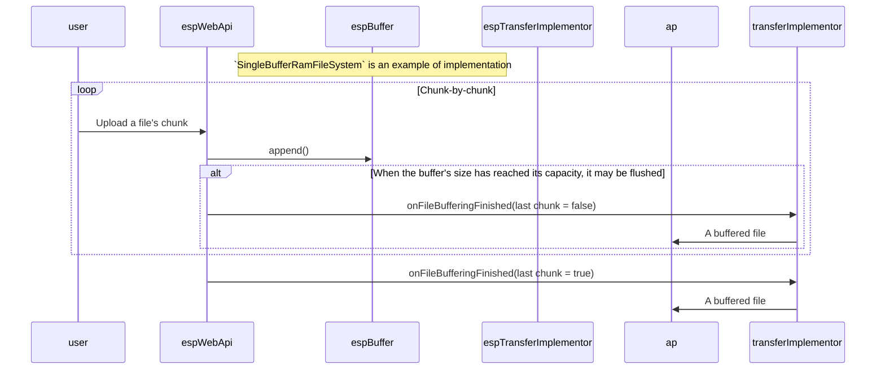

# Buffered file transfer

Facilitates using ESP32 as a communication bridge with a large buffer b/w a
file repository, and the on-board binary storage (such as flash storage on
Pioneer Base / Salute).

Due to low UART throughput, and the recently appeared necessity to flash
multiple boards in parallel, it is reasonable to store whatever files are to be
transfered to the AP in an intermediate storage, and transfer those in
background using UART, which is way slower than the 2.4 GHz channel.

It has some FS-related abstraction layers, because it will probably be needed
to store files in external RAM or flash.

# Stages

BFT component is best conceptualized in the process-oriented way. The entire
process consists of two stages:

1. Buffering
2. Transfer

At/after each of those stages, a participant to the process will notify
respective components over the appropriate event key (see
"buffered_file_transfer/Sub.hpp" for the list of topics).

## Transferring options

### Transferring using Web API

# Buffer memory (RAM)

An encapsulating overhead over a RAM chunk is used, which is comprised of 2
entities:

- File;
    - Stores the current state of writing into the memory;
- File system;
    - Handles allocation affairs.

## Limitations and ontological constraints

- Plain file structure is implied, no directories;
- The process of writing to a file is a multistaged stateful process: open,
  write, close, seek;
- A file is viewed as an array of bytes;

