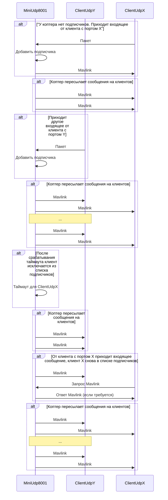

2021-03-05

# Используемые сообщения MAVLINK

* Пометка `Вопрос / ответ` - ожидается ответ от коптера
* Пометка `Вопрос / - ` - сообщение пересылается только на коптер
* Пометка `- / Ответ` - сообщение пересылается только с коптера

## Сообщения COMMAND_LONG (вопрос/ответ)
Передаваемые параметры описаны [здесь](https://mavlink.io/en/messages/common.html#COMMAND_LONG).
Логика работы и передачи таких сообщений описана [здесь](https://mavlink.io/en/services/command.html).

## Поле `command=400` (MAV_CMD_COMPONENT_ARM_DISARM)

### Поле `target_component=1`

Используется для запуска/остановки двигателей.

Значения поля `param1` равные `0` и `1` соответствуют "arm" (запуск) и "disarm" (остановка) двигателей.

Для запуска
```java
CommandLong.builder()
                .command(MavCmd.MAV_CMD_COMPONENT_ARM_DISARM)
                .param1(1)
                .build();
```
Для остановки
```java
CommandLong.builder()
                .command(MavCmd.MAV_CMD_COMPONENT_ARM_DISARM)
                .param1(0)
                .build();
```
### Поле `target_component=25`

Для запуска/остановки lua-скрипта используется команда та же команда, но с другим значением поля `target_component`: `1` - запуск, `0` - остановка.

confirmation - номер пакета (описано в стандарте [COMMAND_LONG](https://mavlink.io/en/services/command.html))

```java
CommandLong.builder()
                .command(MavCmd.MAV_CMD_COMPONENT_ARM_DISARM)
                .targetComponent(25)
                .param1(1)
                .confirmation(i)
                .build();
```

### Ответ от дрона. Сообщение COMMAND_ACK

В ответ на сообщение `COMMAND_LONG` коптер присылает сообщение `COMMAND_ACK`

Структура сообщения описана [здесь](https://mavlink.io/en/messages/common.html#COMMAND_ACK)

Для десериализации в android-приложении используется библиотека dronefleet.


## Сообщения RC_CHANNELS_OVERRIDE (вопрос/-)
Используются для передачи значений стиков на коптер.

Передаваемые параметры описаны [здесь](https://mavlink.io/en/messages/common.html#RC_CHANNELS_OVERRIDE).

Эти сообщения отсылаются в одну сторону.

```java
RcChannelsOverride.builder().
                chan1Raw(throttle).
                chan2Raw(yaw).
                chan3Raw(pitch).
                chan4Raw(roll).
                chan5Raw(mode)
                .build();
```

## Сообщения HEARTBEAT (вопрос/-)
Используются для поддержания соединения с коптером.

Логика работы и передачи таких сообщений описана [здесь](https://mavlink.io/en/services/heartbeat.html).

По стандарту отсылается с частотой 1Hz

```java
Heartbeat.builder().build()
```


## `BATTERY_STATUS` (-/ответ)

Интересующее Вас - `battery_remaining`. Отправляет остаток батареи в `%`.

Подробнее о структуре [battery](https://mavlink.io/en/messages/common.html#BATTERY_STATUS).


# Для сериализации/десериализации в android-приложении используется библиотека dronefleet
В качестве параметров systemId = 255, componentId = 0.

Код сериализации из этой библиотеки:
```java
public void send2(int systemId, int componentId, Object payload) throws IOException {
        MavlinkMessageInfo messageInfo = payload.getClass()
                .getAnnotation(MavlinkMessageInfo.class);
        byte[] serializedPayload = serializer.serialize(payload);
        writeLock.lock();
        try {
            send(MavlinkPacket.createUnsignedMavlink2Packet(
                    sequence++,
                    systemId,
                    componentId,
                    messageInfo.id(),
                    messageInfo.crc(),
                    serializedPayload));
        } finally {
            writeLock.unlock();
        }
    }
```

# Нюансы с подключением
## Требуемые параметры коптера
* `BoardPioneerMini_modules_espBaud=115200`
* `BoardPioneerMini_modules_uMux=3`
Параметры коптера можно менять из приложения `PioneerStation`.

# Работа с UDP/8001 (MAVLink Socket)




# Работа с камерой


```sequence
Copter->Copter: Открывает TCP/8888
Copter->Copter: Открывает UDP/Y
Client->Client: Открывает TCP/X
Client->Client: Открывает UDP/X
Client->Copter: Коннект к Copter:TCP/8888 с Client:TCP/X
Copter->Copter: Accept
Copter->Client: JPEG с UDP/Y на UDP/X
Copter->Client: JPEG с UDP/Y на UDP/X
Copter->Client: JPEG с UDP/Y на UDP/X
Copter->Client: JPEG с UDP/Y на UDP/X
Copter->Client: ...
Client->Copter: Отключение Client:TCP/X от Copter:TCP/8888
Copter->Copter: Перестает отправлять JPEG
```

Обратите внимание, что клиент открывает 2 порта, `TCP/X`, `UDP/X` с одинаковым номером. По номеру TCP-порта клиента коптер определит номер UDP-порта клиента.

## Концепт

В данном случае `TCP/8888` служит флагом, обозначающим, что соединение поддерживается.

Пара сокетов `TCP/8888` и `UDP/Y` логически **никак не связаны** с `UDP/8001`, отвечающим за `MAVLink`.

# Заключение 

Текущее взаимодействие с коптером описывается 5-ю сообщениями `MAVLink`.

Коптер реализует отправку `JPEG` сообщений с сериями.

В качестве инструментария и примеров рекомендуется использовать:
* QGroundControl - исключительно для того, удостовериться, что коптер настроен правильно, и с ним можно общаться по `MAVLink`;
* Python-овские скрипты, где в директории `snippets/` выполняются некоторые базовые команды;
* Код `Android`-приложения, которые Вам скинули наши разработчики.
* `PioneerStation` - для проставления параметров.

# Исправления
